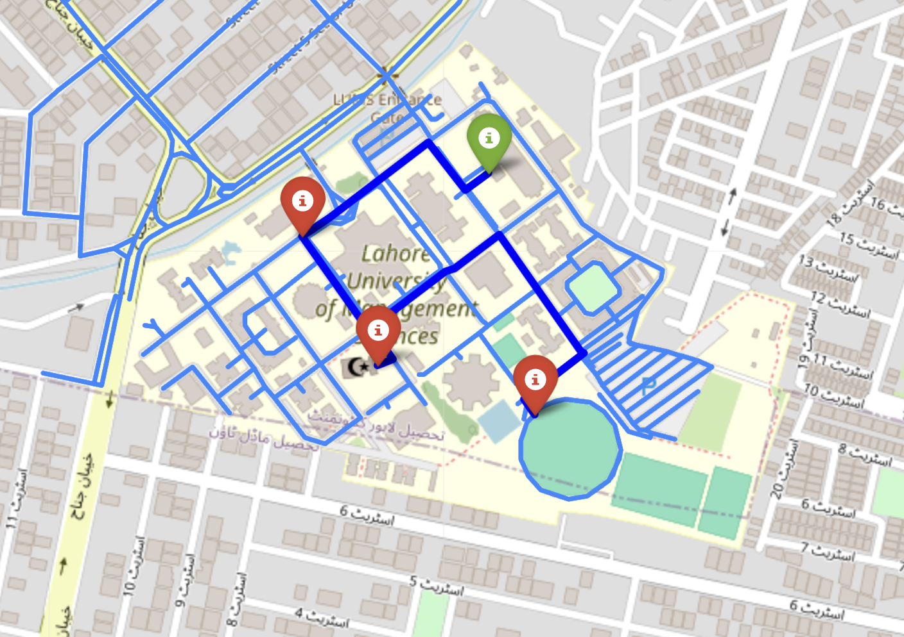

# Hi, I'm Haris! 👋


[](https://choosealicense.com/licenses/mit/) 


# Searches Assignment (Artificial Intelligence)

This Jupyter Notebook explores the concepts of Searches in Artificial Intelligence, with a particular focus on three search algorithms (and slight variations of each):
<ol>
<li> A* </li>
<li> Best-first search </li>
<li> Breadth-first search </li>
</ol> <br>

The notebook is structured to provide a comprehensive understanding of these search algorithms, and includes practical implementations, visualizations, and evaluations of the algorithms. <br> 

The Searches folder contains the following files:
- A .ipynb file (Jupyter Notebook) that contains all the code regarding the assignment including text blocks explaining portions of the code
- A corresponding .py file
- a png file of a screenshot of how visualizations are used in the Jupyter Notebook

## Table of Contents

1. [Introduction](#introduction)
2. [Installation Requirements](#installation-requirements)
3. [Project Structure](#project-structure)
4. [Training and Evaluation](#training-and-visualization)
5. [Challenges](#challenges)
6. [Screenshots](#screenshots)
   
## Introduction

Search algorithms are fundamental techniques in AI for navigating and finding solutions in large problem spaces. They systematically explore paths or possibilities to identify optimal solutions, such as the shortest route or best outcome. These algorithms, including A*, Best-first search, and Breadth-first search, play a crucial role in applications ranging from route planning to decision-making systems.

 This assignment provides a clear and concise example of how to implement these search algorithms from scratch using Python.
 
## Installation Requirements

To run this notebook, you will need the following packages:
- osmnx
- Iframe
- networkx
- folium
- display
- matplotlib
- numpy
- math
- queue

You can install these packages using pip:

```bash
 import osmnx as ox
```
```bash
 from IPython.display import IFrame
```
```bash
 import networkx as nx
```
```bash
import folium
```
```bash
from IPython.display import display
```
```bash
import matplotlib.pyplot as plt
```
```bash
 import numpy as np
```
```bash
 from math import radians, sin, cos, sqrt, atan2
```
```bash
 import queue
```
<strong> Make sure to run the first command in the code block, i.e run all other commands in your terminal whereas the first command should be run in the Jupyter Notebook code block. </strong> <br>
Useful Links for installing Jupyter Notebook:
- https://youtube.com/watch?v=K0B2P1Zpdqs  (MacOS)
- https://www.youtube.com/watch?v=9V7AoX0TvSM (Windows)

It's recommended to run this notebook in a conda environment to avoid dependency conflicts and to ensure smooth execution.
<h4> Conda Environment Setup </h4>
<ul> 
   <li> Install conda </li>
   <li> Open a terminal/command prompt window in the assignment folder. </li>
   <li> Run the following command to create an isolated conda environment titled AI_env with the required packages installed: conda env create -f environment.yml </li>
   <li> Open or restart your Jupyter Notebook server or VSCode to select this environment as the kernel for your notebook. </li>
   <li> Verify the installation by running: conda list -n AI_env </li>
   <li> Install conda </li>
</ul>


## Project Structure

The notebook is organized into the following sections:
<ul>
<li> Problem Description: describes the purpose of the assignment </li> <br> 
<li> Details about the osmnx and folium python libraries and how they are to be used in the assignment.  </li> <br> 
<li> Three functions that were already provided in the Jupyter Notebook: 
   <ol>
      <li> Road Network Data Retrieval Function (get_road_network) </li>
      <li> Road Network Visualization Function (visualize_road_network) </li>
      <li> Shortest Path Visualization Function (visualize_path_folium) </li>
   </ol> 
</li> <br> 
<li> Mathematical details of the Eulidean, Manhattan and Haversine distances, that are used in the implementation of heuristic functions </li> <br> 
<li> Task 0: Implementing Heuristics --- implements functions to calculate the three heuristics </li> <br> 
<li> Task 1: A* Algorithm Implementation --- implements the A* algorithm to find the shortest path between a source node and a target node. </li> <br> 
<li> Task 2: Best-First Search Algorithm Implementation --- implements the Best-First Search algorithm to find a path between a source node and a target node.</li> <br> 
<li> Task 3: Informed Breadth-First Search Algorithm Implementation --- implements the Breadth-First Search algorithm using heuristics to find a path between a source node and a target node.</li> <br> 
<li> Visual representation of the maps showing the various paths identified by the algorithms </li> <br> 
<li> Implementation of the A* Algorithm using the built-in function of the NetworkX library, along with its visual map representation </li> <br> 
<li> Task 4: Single Source And Multiple Destinations using A star --- implements the A* Algorithm such that it can identify the optimal paths for MULTIPLE destinations, along with its visual map representation. </li> <br> 
<li> Brief comparative analysis of the different algorithms used in the assignment to implement the searches. </li> <br> 
</ul>


## Training and Visualization

The entire training process alongside the maths involved is explained in detail in the jupyter notebook. 
- Note: You need to be proficient in Python Programming to fully implement the complex algorithms shown in this assignment.

## Challenges

1. **Performance Optimization**: Implementing search algorithms can be computationally intensive, especially for large datasets or complex graphs. To address this, optimizing the algorithms for efficiency, using heuristics to prune the search space, and leveraging data structures like priority queues can significantly improve performance.

2. **Memory Usage**: Search algorithms often require substantial memory to store nodes and paths, which can be challenging for large-scale problems.

3. **Heuristic Design**: For algorithms like A* and Best-first search, designing effective heuristics is critical for performance. Testing various heuristics and using domain-specific knowledge to refine them can enhance the algorithm’s accuracy and efficiency.

5. **Complexity of Implementation**: Implementing and integrating search algorithms can be complex, especially when dealing with variations or combining multiple algorithms. Careful planning, modular design, and thorough testing can help manage this complexity and ensure robust functionality.

## Screenshots
<h4> This image is an example of several used in this assignment. This one in specific shows a map representation of the modified A* algorithm used to go to multiple destinations in the most optimal way. <br> 
The diagram shows a map of the Lahore University of Management Sciences. The light blue lines show all the possible ways to walk around LUMS whereas the dark blue lines show the result of the modified A* algorithm from the source (shown in green) to three different destinations (shown in red). <br>
You can change the last code block to change the source or destinations. You can find the node values of the different buildings in LUMS by inspecting the first map in the assignment under the heading <strong>Road Network</strong>.</h4>
 <br> 


## License

[MIT](https://choosealicense.com/licenses/mit/)
